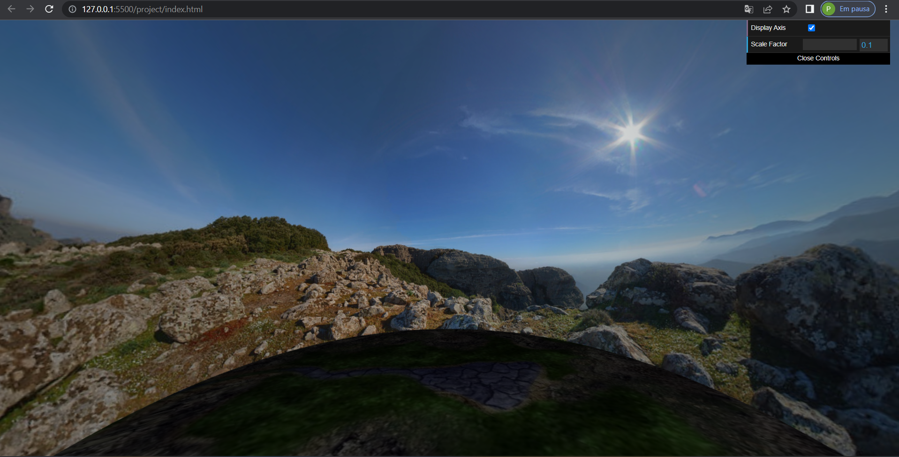
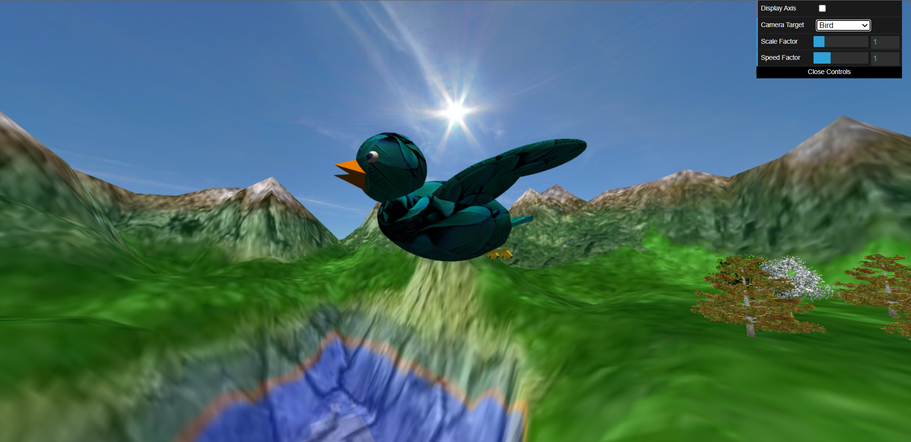
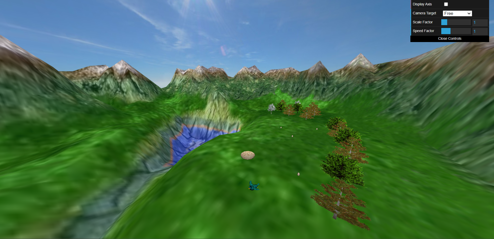
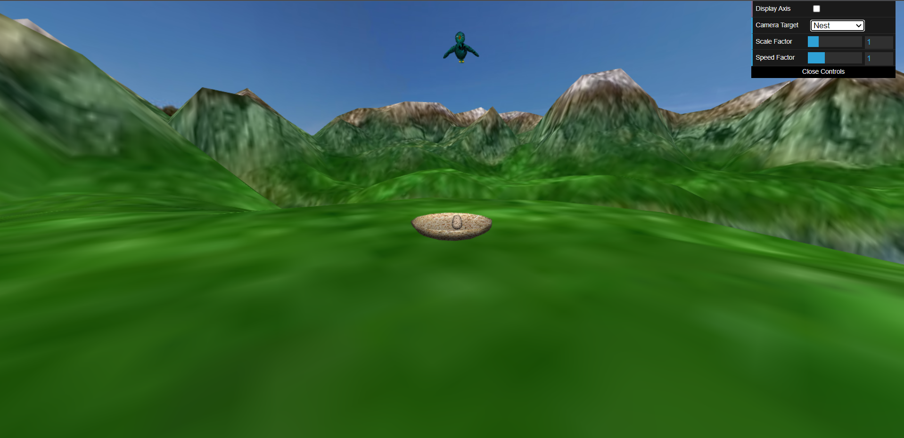
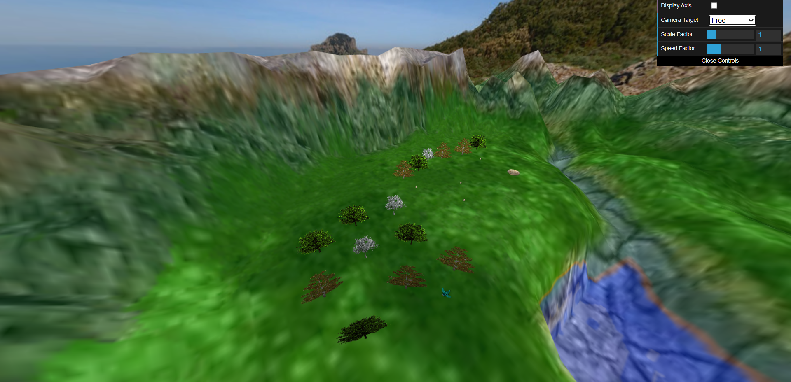

# CG 2022/2023 - Project

## Group T04G06
| Name             | Number    | E-Mail               |
| ---------------- | --------- | -------------------- |
| Pedro Balazeiro  | 202005097 | up202005097@fe.up.pt |
| Rúben Viana      | 202005108 | up202005108@fe.up.pt |

## OBSERVATIONS

- The additional development feature chosen was the parabola (option A). As for the rest nothing relevant to add.

## SCREENSHOTS

#### **1 - Scene and panorama:**

#### **2 - Bird model:**

#### **3 - Terrain:**

#### **4 - Eggs and nest:**

#### **5 - Forest:**

#### **6 - Additional development (parabola):**
")
